# Overview

This repo is created to provide a prototype for the RAG chatbot productionizing. 
It mainly contains 4 sections:

* Application deployment with minikube
* Monitoring setup with Prometheus and Grafana
* RAG pipeline monitoring framework with Arize Phoenix
* RAG performance optimization

Please note all the tools/platforms/services chosen to be implemented in this repo are for prototype, considerations for production choices will be elaborated in a separate document.

# App Deployment

## Set up env file
Since I am using OpenAI API to call GPT3.5 Turbo as foundation model for this test, the first step is to set up an env file to keep a valid api key.

Open source LLMs are also usable through Huggingface pipeline, but to ensure better RAG evaluation quality in further steps I will stay with GPT3.5 Turbo for now. 

Also for the RAG monitoring tool, need to set up an env variable for the endpoint as well.

## Set up minikube
A local cluster is used to test the deployment of this chatbot, please make sure minikube is ready on your device.

Here are some instructions to install minikube:
https://minikube.sigs.k8s.io/docs/start/?arch=%2Fmacos%2Farm64%2Fstable%2Fhomebrew#Service

Set configs for minikube to increase resource allocation:
- `minikube config set cpus 4`
- `minikube config set memory 4096`

You should see the message below if minikube is set up properly
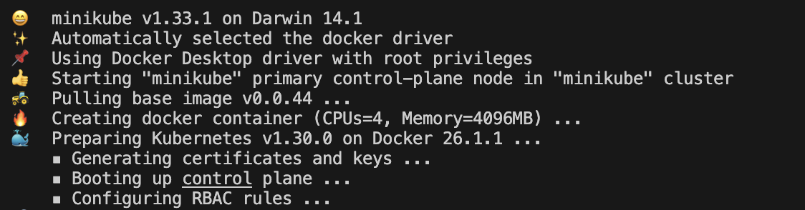

## Set up Prometheus and Grafana
- first need to install helm
- then follow this instruction: https://blog.marcnuri.com/prometheus-grafana-setup-minikube

## Deploy the chatbot to minikube (same process for the evaluation tool)
- build the chatbot image: `docker build -t bmo-chatbot` .
- copy local image to minikube: `minikube image load bmo-chatbot`
- [first time only] create deployment yaml: `kubectl create deployment bmo-chatbot --image=bmo-chatbot --dry-run=client -o yaml > bmo-chatbot.yaml`
- start the deployment: `kubectl apply -f bmo-chatbot.yaml`
- expose the app: `kubectl apply -f bmo-chatbot-service.yaml`
- launch the UI: `minikube service bmo-chatbot-service`

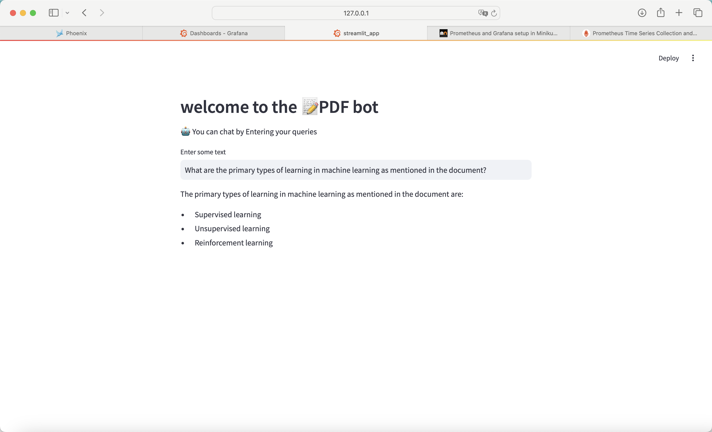

# Monitoring setup with Prometheus and Grafana

## Prometheus and Grafana preview
- launch monitoring UI: `minikube service prometheus-service-np & minikube service grafana-np`
- go to Prometheus UI and check if pod data is being collected - can search for metrics on the pod, if some data is showing up then it verifies the monitoring is on (e.g. container_memory_rss and {pod='bmo-chatbot-757f544c7d-rpzv4'})

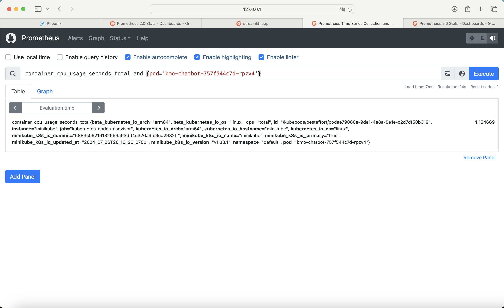

- go to Grafana and customize the monitoring dashboards. Usually metrics like memory usage, cpu usage, pod status, system load, latency, error rate will be included, can also check metrics with high cardinalities (https://grafana.com/docs/grafana-cloud/cost-management-and-billing/analyze-costs/metrics-costs/prometheus-metrics-costs/usage-analysis-explore/)

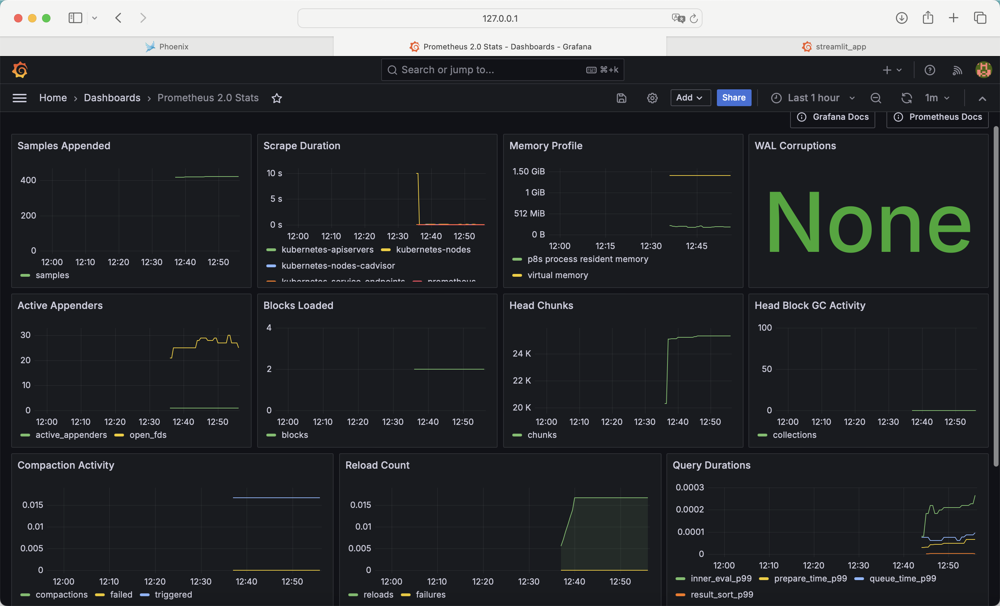

## Customize monitoring dashboard for the local cluster and chatbot

Can mimic sample dashboards (e.g. Prometheus stats and Grafana) to create visualizations, basically need to query for metrics and labels (e.g. job, pod).

Some interesting metrics for chatbot performance monitoring:
- CPU usage/requests/limits
- Memory usage/requests/limits
- User query response time
- Request error ratio
- Number of user query
- Number of active sessions

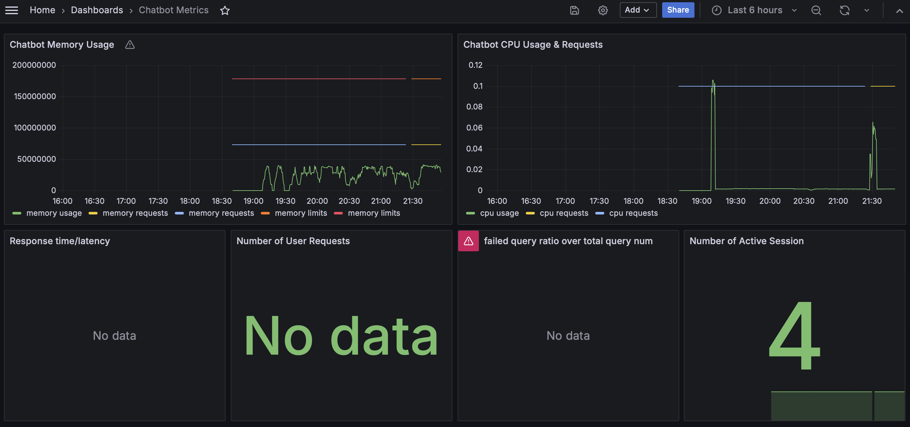

# RAG pipeline monitoring framework with Arize Phoenix

## query logging and cost management

All live queries entered by users will be logged by Phoenix, with all details of the chains, latency and token cost breakdown. Real-time evaluation is also conductable but would increase the latency and token costs.

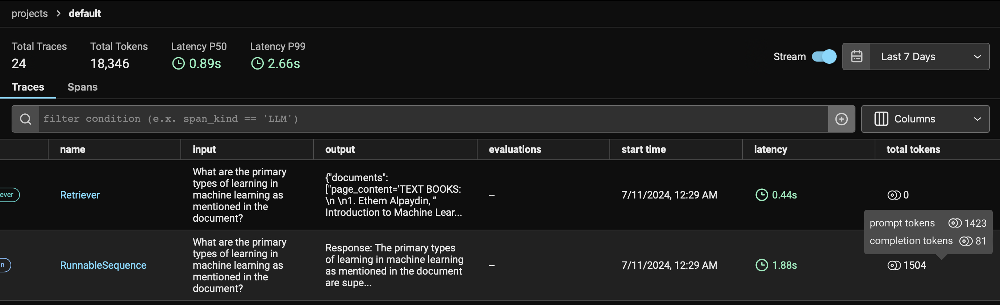

## evaluate RAG pipelines with ragas framework on sample Q&As
execute below in terminal:

- basic rag: `python3 evaluation/phoenix_test.py --better_rag no`
- improved rag: `python3 evaluation/phoenix_test.py --better_rag yes`

## evaluation results

| Model       | Latency P50 | Faithfulness | Answer Correctness | Context Recall | Context Precision | Answer Relevancy | Hallucination | QA Correct | Total Tokens (excluding eval tokens) |
|-------------|-------------|--------------|--------------------|----------------|-------------------|------------------|---------------|------------|--------------------------------------|
| Basic RAG   | 1.52s       | 0.9          | 0.56               | 0.73           | 0.91              | 0.86             | 0.09          | 0.91       | 10183                               |
| Refined RAG | 2.13s       | 0.92         | 0.63               | 0.8            | 0.91               | 0.88             | 0             | 1          | 13508                               |

## phoenix screenshots
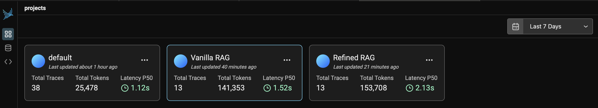
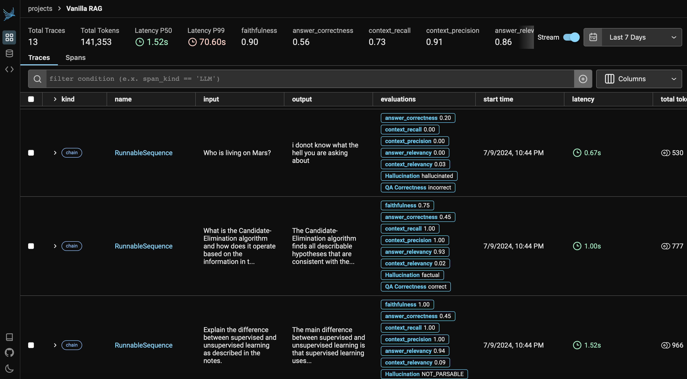

# RAG Performance Optimization

## Retrieval Improvement

Implemented in this repo:
- Hybrid search: combine key-word based search and embedding search
- Integrating reranking (https://huggingface.co/BAAI/bge-base-en-v1.5) and redundancy filter
- Prompt optimization

Other potential methods (consider costs such as time, complexity add, token/computing costs):
- Query expansion
- TF-IDF to distinguish similar but distant words such as 'Google earnings' and 'Apple earnings'
- Fine-tune embedding models
- Metadata filtering (for vectorDB with many different documents)
- Context window (parent documents)

## FAQs and User Feedback Collection
In production, there are two external database should be set up to further enhance the RAG system:

* a FAQs database to collect commonly asked questions which can be reused for search
* a user feedback database to store usage/feedback logs which can be used as user experience measurement, and potentially used for RLHF in the future

### FAQs

Track user queries to identify FAQs and enhance FAQs database so similar questions can potentially be answered by FAQs without calling the LLMs

When the user enter a query, and if similar questions have been found in FAQs database, matched FAQs will pop up:

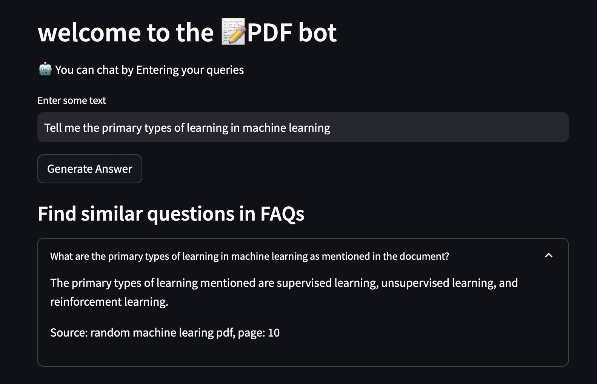

Users are allowed to modify and contribute to the FAQs database

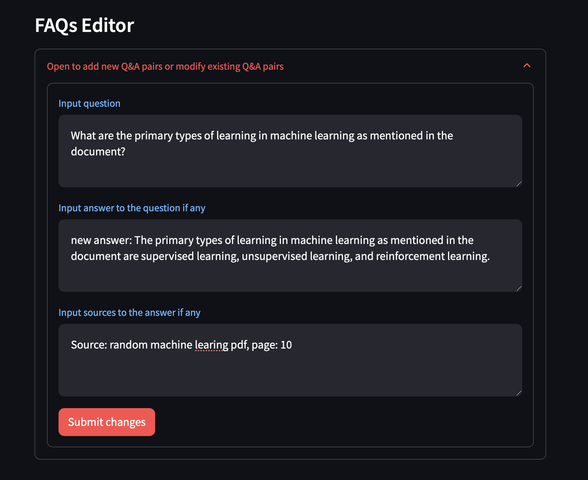

### Feedback

Users are able to give feedback to the generated answers, which could be used for RLHF in the future. User feedback is also a direct measurement of the reliability and performance of the chatbot.

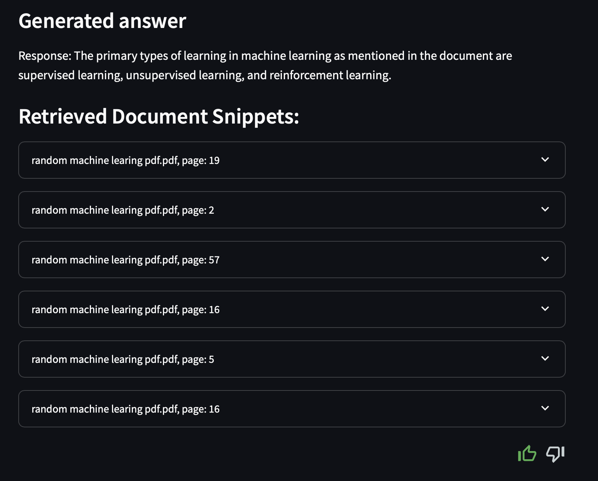

# Future Improvements

- Logging data and FAQs that are temporarily saved in excel files can be moved to more scalable database such as PostgreSQL

- More scalable and efficient vector databases are considerable such as Pinecone and Weaviate, especially when the data size gets larger. Metadata filtering can also be applied to boost searching efficiency. But these commercial optiosn might require API connection and subscription.

- Cloud platforms could be a better choice for the chatbot deployment in production considering their scalability and diverse integrated functions such as monitoring, model training and other analytics tools.

- Adding multimodal data tools such as Unstructred, memory buffer, agentic workflow ...

# Appendix

### RAG test queries
1.	What are the primary types of learning in machine learning as mentioned in the document?

•	The primary types of learning mentioned are supervised learning, unsupervised learning, and reinforcement learning.

2.	Can you explain the concept of VC (Vapnik-Chervonenkis) dimension as described in the text?

•	The VC dimension is a measure of the capacity of a set of functions that can be learned by a classification algorithm. It represents the largest set of points that can be shattered (correctly classified) by the hypothesis set.

3.	What role does the concept of ‘Generalization’ play in machine learning according to the lecture notes?

•	Generalization describes the process of applying the knowledge learned from the training data to new, unseen situations. It involves discovering properties of the data that will be relevant to performing well on future tasks.

4.	Describe the ID3 algorithm for decision trees as outlined in the document.

•	The ID3 algorithm is a method used to create a decision tree by splitting the dataset based on the attribute that offers the highest information gain. It recursively partitions the data till it meets a stopping criterion.

5.	What is the PAC (Probably Approximately Correct) learning framework and how is it applied?

•	PAC learning is a framework that evaluates machine learning algorithms based on the concept that a learner should be able to learn a function from training examples such that, with high probability, the learned function will have low error on unseen examples.

6.	How does the document explain the use of neural networks in machine learning?

•	Neural networks are presented as a powerful model for learning complex patterns in data. They consist of layers of interconnected nodes that can learn to represent data features and perform tasks like classification and regression through training.

7.	What are the main components of a machine learning system as detailed in the provided PDF?

•	The main components include data storage, abstraction, generalization, and evaluation. These components represent the stages through which data is transformed into actionable knowledge.

8.	Discuss the example of the ‘Enjoy Sport’ learning task mentioned in the text.

•	The ‘Enjoy Sport’ example is a concept learning task where the goal is to determine whether or not one should play a sport based on various weather conditions like sky, air temperature, humidity, etc., using a series of hypotheses represented as a decision tree.

9.	Explain the difference between supervised and unsupervised learning as described in the notes.

•	Supervised learning involves training a model on a labeled dataset, where the correct answers (targets) are known, allowing the model to learn a mapping from inputs to outputs. Unsupervised learning involves training a model on data without labels to discover the underlying patterns or distributions.

10.	What is the Candidate-Elimination algorithm and how does it operate based on the information in the document?

•	The Candidate-Elimination algorithm incrementally refines the hypothesis space by removing hypotheses that are inconsistent with any observed training example. It maintains a set of general hypotheses (G) and specific hypotheses (S) that are consistent with all observed examples.

11. Who is living on Mars?

•	I do not have the information you are seeking.

